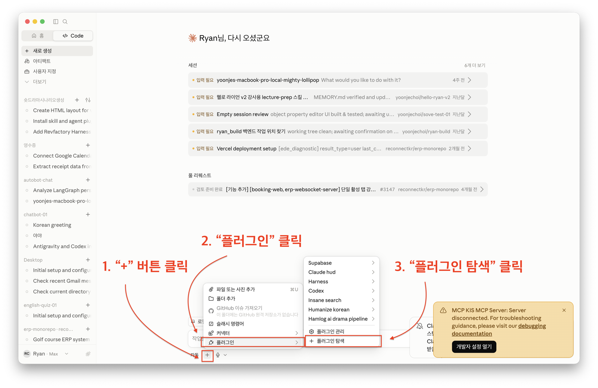
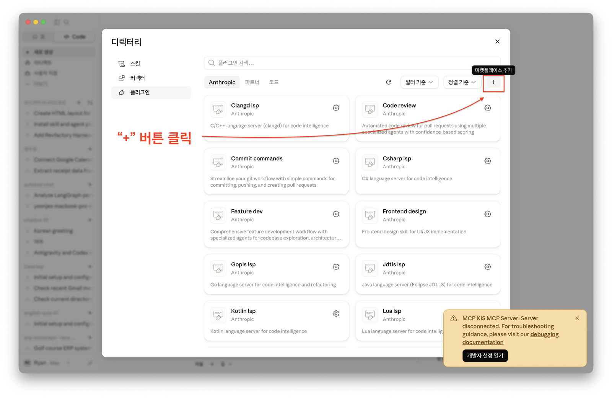
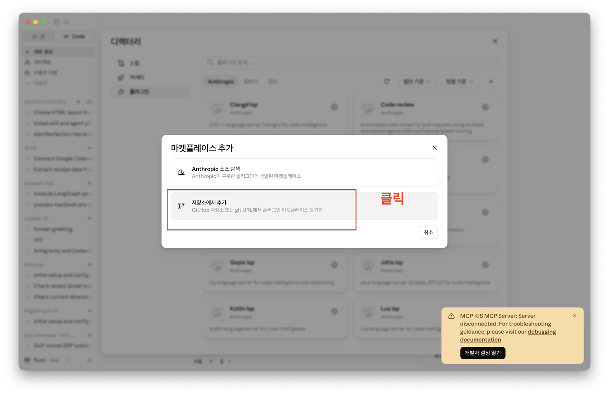
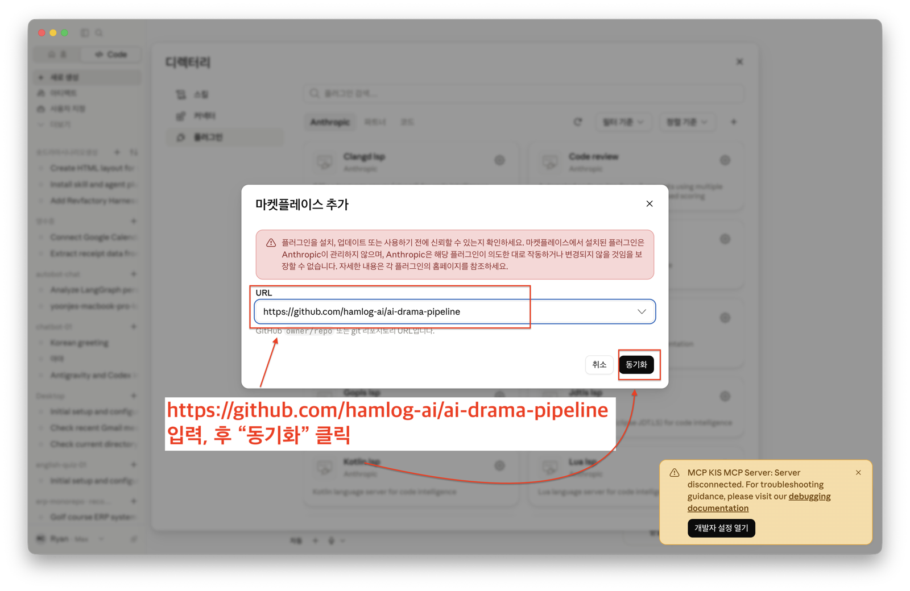
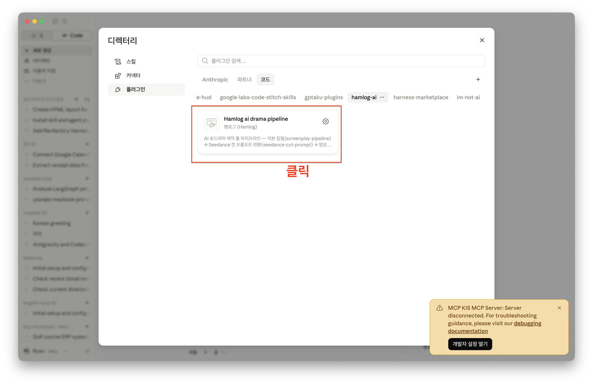
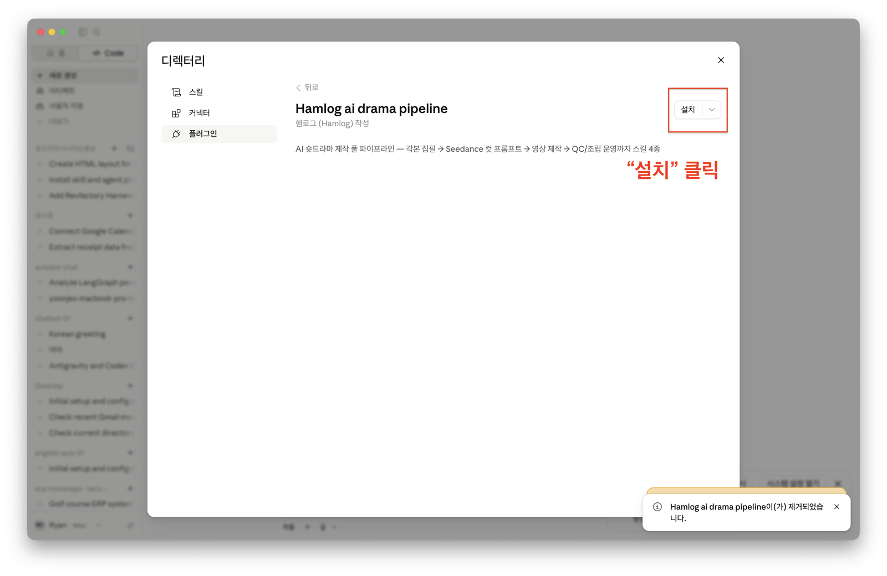
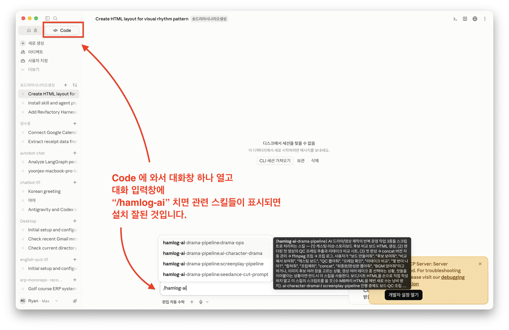

# 🎬 AI Drama Pipeline — 햄로그(Hamlog) 마켓플레이스

🌍 [English README](README.en.md)

**스토리 아이디어 하나로 AI 숏드라마 완성본까지.**
"각본 → 컷 프롬프트 → 영상 렌더 → QC → 조립"의 전 과정을 커버하는
Claude Code 스킬 4종 세트입니다.

> 처음이신가요? **Claude 데스크톱 앱**을 쓰신다면 바로 아래 **「설치 1 — 그림 따라 설치」**,
> **터미널에서 Claude Code**를 쓰신다면 **「설치 2 — 명령어 2줄」**을 보세요.

## 🖱 설치 1 — Claude 데스크톱 앱에서 그림 따라 설치 (초보자 추천)

터미널을 한 번도 써본 적 없어도 괜찮습니다. **아래 그림 7장을 순서대로 그대로 따라 하면 설치가 끝납니다.**
(Claude 데스크톱 앱 = [claude.com/download](https://claude.com/download) 에서 받은 앱. Pro 이상 구독 필요)

### 1️⃣ 앱 왼쪽 위 `Code` 탭 → 입력창 옆 `+` 버튼 → `플러그인` → `플러그인 탐색`



### 2️⃣ `디렉터리` 창이 열리면, 왼쪽에서 `플러그인` 선택 → 오른쪽 위 `+`(마켓플레이스 추가) 클릭



### 3️⃣ `저장소에서 추가` 클릭



### 4️⃣ URL 칸에 아래 주소를 붙여넣고 `동기화` 클릭

```
https://github.com/hamlog-ai/ai-drama-pipeline
```



### 5️⃣ 위쪽 `코드` 탭 → `hamlog-ai` 선택 → `Hamlog ai drama pipeline` 카드 클릭



### 6️⃣ 오른쪽 위 `설치` 버튼 클릭



### 7️⃣ 설치 확인 — `Code`에서 대화창을 하나 열고 입력창에 `/hamlog-ai` 입력

스킬 4종 목록이 뜨면 **설치 성공**입니다 🎉



> 목록이 안 뜨면 Claude 앱을 완전히 껐다가 다시 켜고 한 번 더 확인해 보세요.

## ✨ 무엇을 할 수 있나요?

- "이런 스토리야, 3부작 숏드라마 대본 써줘" → **한국어 각본**이 트리트먼트부터 Word 파일까지 단계별로 완성됩니다.
- "S#3 영상 프롬프트 줘" → 씬이 **Seedance 2.0용 15초 컷 프롬프트**(3비트 구조, 대사 음절 예산, 캐릭터 Element 태그)로 변환됩니다.
- "이 대본으로 1분짜리 숏드라마 만들어줘" → 캐릭터 시트 생성부터 컷 렌더, 자막·SFX·나레이션, 최종 조립, BGM까지 **영상 제작 전체**를 총괄합니다.
- "캐스팅 보드 만들어줘 / QC 뽑아줘 / 컷 합쳐줘" → 후보 비교 보드, 프레임 QC, concat 조립 같은 **반복 작업이 스크립트로 자동화**됩니다.

## ⌨️ 설치 2 — 터미널(Claude Code CLI)에서 명령어 2줄

Claude Code를 열고 아래 두 명령어를 차례로 입력하세요:

① 마켓플레이스 추가:

```
/plugin marketplace add hamlog-ai/ai-drama-pipeline
```

② 플러그인 설치:

```
/plugin install hamlog-ai-drama-pipeline@hamlog-ai
```

설치 후 Claude Code를 재시작하면 스킬 4종이 자동으로 인식됩니다.

<details>
<summary>플러그인 없이 스킬 폴더만 복사하고 싶다면 (수동 설치)</summary>

```bash
git clone https://github.com/hamlog-ai/ai-drama-pipeline.git
cp -R ai-drama-pipeline/skills/* ~/.claude/skills/
```

git이 없다면 [Releases](https://github.com/hamlog-ai/ai-drama-pipeline/releases)에서
`ai-drama-pipeline.zip`을 내려받아 압축을 풀고, 안의 `skills/` 폴더 내용물을
`~/.claude/skills/`에 복사해도 똑같이 동작합니다.

특정 프로젝트에서만 쓰려면 `~/.claude/skills/` 대신 그 프로젝트의
`.claude/skills/`에 복사하세요. Claude Code 재시작 후 적용됩니다.

</details>

## 🔄 파이프라인 흐름

```
스토리 아이디어
   │
   ▼
screenplay-pipeline    각본 집필 (트리트먼트 → 씬별 대본 → IP 체크 → Word 변환)
   │
   ▼
seedance-cut-prompt    씬(S#N) → Seedance 2.0 컷 프롬프트 변환
   │                   (15초 3비트, 음절 예산, Element 태그, 블로킹 락)
   ▼
ai-character-drama     영상 제작 총괄 (캐릭터 시트 → Element → 컷 렌더
   │                   → 자막/SFX/나레이션 → 조립 → BGM)
   ▼
drama-ops              반복 운영 (후보 비교 보드 · QC 프레임 추출
                       · 리테이크 비교 · concat 조립 · 조립 로그)
```

## 📦 포함된 스킬 4종

| 스킬 | 역할 | 이렇게 말하면 실행돼요 |
|---|---|---|
| `screenplay-pipeline` | 스토리 피치를 받아 한국어 각본을 단계별로 완성 (밈 패러디 삽입, IP 체크리스트, Word 변환 포함) | "이런 스토리야 — 대본 써줘" |
| `seedance-cut-prompt` | 각본 씬을 Seedance 2.0용 15초 컷 프롬프트로 변환, 정책위반 시 리라이트 | "S#3 영상 프롬프트 줘" |
| `ai-character-drama` | 캐릭터 일관성(3이미지 시트 + Element) 기반으로 영상 제작 전 과정 총괄 | "1분짜리 숏드라마 만들어줘" |
| `drama-ops` | 보드/QC/조립 파이썬 스크립트 3종 — HTML 보드를 손으로 짜지 않게 해줌 | "캐스팅 보드 만들어줘" |

**의존 관계**: `seedance-cut-prompt`는 `ai-character-drama/references/`의 문서를
참조하므로 두 스킬은 반드시 함께 있어야 합니다. 플러그인으로 설치하면 4종이
한 번에 들어오므로 신경 쓸 필요 없습니다.

## 🛠 요구 사항

| 용도 | 필요한 것 | 필수 여부 |
|---|---|---|
| 영상 생성 | Seedance 2.0 지원 생성 MCP 서버 (Element/참조 이미지 등록 가능해야 함) | 영상 제작 시 필수 |
| 조립/QC | `ffmpeg` (`brew install ffmpeg`) | 조립 단계 필수 |
| Word 변환 | Node.js | 각본 .docx 출력 시 |
| 나레이션/SFX | ElevenLabs MCP | 선택 |
| BGM | Suno (suno.com 웹에서 직접 생성 → `music/bgm.mp3`로 저장) | 선택 |

각본 집필과 컷 프롬프트 변환은 위 도구 없이도 Claude Code만으로 동작합니다.

## 💬 사용 예시

```
"사막에서 화살 하나로 운명이 갈리는 남매 이야기야. 3부작 숏드라마 대본 써줘"
→ screenplay-pipeline이 트리트먼트부터 씬별 대본까지 완성

"S#2 영상 프롬프트 줘. 9:16 세로로"
→ seedance-cut-prompt가 15초 컷 프롬프트로 변환

"이 대본으로 쇼츠 만들어줘"
→ ai-character-drama가 캐릭터 시트 → 렌더 → 자막 → 조립까지 진행

"컷 후보들 비교 보드 만들어줘"
→ drama-ops가 HTML 비교 보드를 자동 생성
```

## ❓ 자주 묻는 질문

**Q. 영상 생성 MCP가 없는데 쓸 수 있나요?**
A. 네. 각본 집필(`screenplay-pipeline`)과 컷 프롬프트 변환(`seedance-cut-prompt`)은
텍스트 산출물이라 바로 쓸 수 있습니다. 프롬프트를 받아 Seedance를 지원하는
아무 플랫폼에나 붙여넣으면 됩니다.

**Q. 컷 프롬프트가 "정책위반(policy violation)"으로 거부돼요.**
A. 거부된 프롬프트를 그대로 붙여넣고 "정책위반 났어"라고 말하면
`seedance-cut-prompt`가 IP 세이프 네이밍으로 리라이트해 줍니다.

**Q. 업데이트는 어떻게 받나요?**
A. `/plugin marketplace update hamlog-ai` 를 실행하면 최신 버전을 받아옵니다.

## 📄 라이선스

CC BY-ND 4.0 — 자유롭게 쓰고 원본 그대로 공유하되, 출처(햄로그)를 표기해 주세요.
수정한 버전을 재배포하는 것은 금지됩니다. ([LICENSE](LICENSE))

---

Made with 🐹 by **햄로그(Hamlog)**

- 🧵 Threads: [@hamlog_ai](https://www.threads.com/@hamlog_ai)
- 💬 카카오톡 오픈채팅: [햄로그 AI 영상 특강방](https://open.kakao.com/o/gMTtW19h)
- 📧 이메일: [ai.hamlog@gmail.com](mailto:ai.hamlog@gmail.com)
